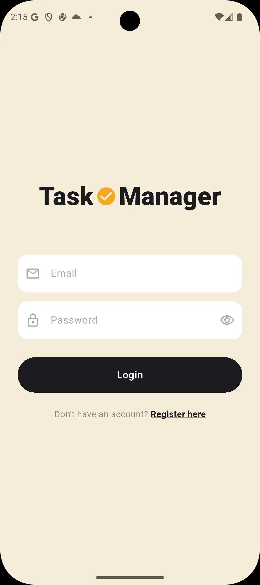
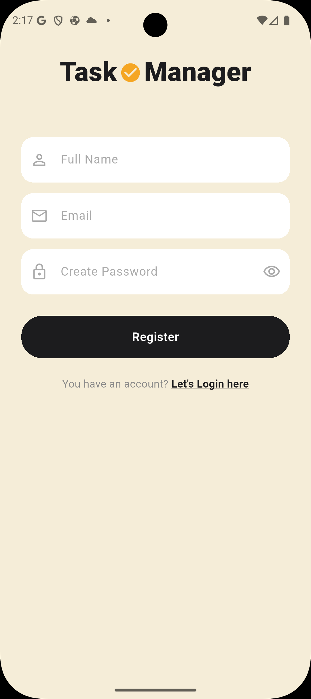
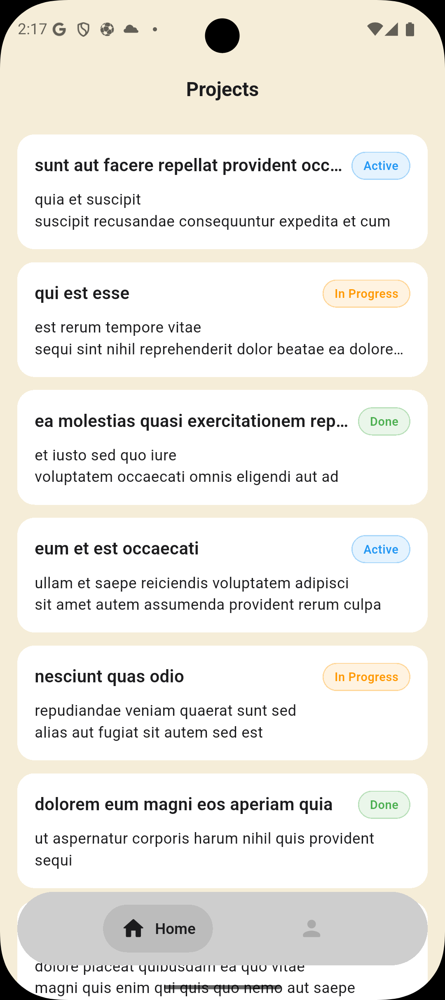
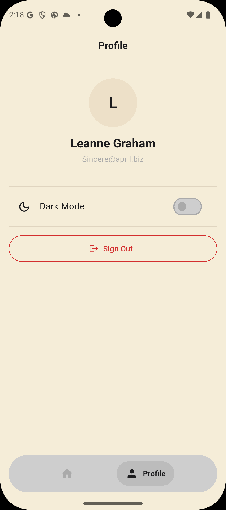

# Task✓Manager

A Flutter Task Manager app built as a technical assessment for **Electro Pi** (Flutter Mobile Developer — 1–2 Years Experience).

---

## Screenshots

| Splash | Login | Register |
|--------|-------|----------|
|  |  |  |

| Projects | Project Details | Profile |
|----------|----------------|---------|
|  |  |  |

> Place screenshots in a `screenshots/` folder at the project root.

---

## Project Description

Task✓Manager lets users manage projects and their associated tasks. It integrates with the [JSONPlaceholder](https://jsonplaceholder.typicode.com) mock REST API to simulate a real backend.

### Features

- **Authentication** — Login and registration with secure token storage. Auto-navigates to home on relaunch if the session is still active.
- **Projects Screen** — Lists all projects with title, description, and status badge. Supports pull-to-refresh and an empty state widget.
- **Project Details Screen** — Shows all tasks for a selected project. Each task displays its title, status (Pending / In Progress / Done), and priority (Low / Medium / High). Tasks can be marked as done and new tasks can be added via a bottom sheet with a priority selector. When all tasks are marked done, the project status updates to Done automatically.
- **Profile Screen** — Displays the logged-in user's name and email with a sign-out button.
- **Dark Mode** — Toggle from the Profile screen. The preference is persisted with SharedPreferences and restored on next launch.

---

## Architecture

**MVVM + Riverpod 3.x**

Each feature follows a 4-layer directory structure:

```
features/{feature}/
├── models/          # Data classes  (Model)
├── data/            # Repositories  (Model)
├── view_models/     # Notifiers + Providers  (ViewModel)
└── views/           # Screens + Widgets  (View)
```

**Navigation** is handled by GoRouter with an auth-based redirect guard (`_RouterNotifier extends ChangeNotifier`).

**Core layer** (`lib/core/`) contains the HTTP client, secure storage service, shared theme, reusable widgets, and infrastructure providers.

---

## API Notes

This app uses [JSONPlaceholder](https://jsonplaceholder.typicode.com) as a mock API. Since it has no real authentication endpoint:

| App Concept | Endpoint | Notes |
|---|---|---|
| Login | `GET /users?email={email}` | Looks up user by email; any password is accepted |
| Register | `POST /users` | Returns a fake user; not persisted server-side |
| Projects | `GET /posts` | `/posts` mapped to projects |
| Tasks | `GET /posts/{id}/comments` | `/comments` mapped to tasks |
| Add task | `POST /posts/{id}/comments` | Returns fake id 501 |
| Mark done | `PATCH /comments/{id}` | Accepted but not persisted server-side |

**Token:** The user's `id` is stored as the session token (JSONPlaceholder has no JWT). In a production app this is replaced with a real server-issued token.

**Priority:** Not a real API field — derived from `task.id % 3` for fetched tasks, and chosen by the user when creating new tasks.

**Test credentials:** Use any email from JSONPlaceholder's seeded users, e.g.
```
Email:    Sincere@april.biz
Password: any string (6+ characters)
```

---

## How to Run

### Prerequisites

- Flutter SDK `>= 3.8.1` — [install guide](https://docs.flutter.dev/get-started/install)
- An Android emulator / physical device **or** Chrome for web

### Steps

```bash
# Clone the repository
git clone https://github.com/your-username/task-manager.git
cd task-manager

# Install dependencies
flutter pub get

# Run on Android
flutter run

# Run on Chrome (web)
flutter run -d chrome

# Build a release APK
flutter build apk --release
```

> **First-run note on Android:** If you see a connection timeout, run `flutter clean && flutter run` to ensure the INTERNET permission and SSL configuration are compiled correctly.

---

## Dependencies

### Runtime

| Package | Version | Purpose |
|---|---|---|
| `flutter_riverpod` | ^3.3.1 | State management — MVVM ViewModels |
| `dio` | ^5.7.0 | HTTP client |
| `go_router` | ^14.6.3 | Declarative navigation + auth redirect |
| `flutter_secure_storage` | ^9.2.4 | Encrypted token & user data storage |
| `shared_preferences` | ^2.3.3 | Persist dark mode preference |
| `salomon_bottom_bar` | ^3.3.2 | Floating pill-style bottom navigation |

### Dev

| Package | Version | Purpose |
|---|---|---|
| `mocktail` | ^1.0.4 | Mocking for unit tests |
| `flutter_lints` | ^5.0.0 | Dart/Flutter lint rules |

---

## Implementation Notes

- **Package name** is `task_manager` (renamed from `test`) to avoid conflicts with `package:test`.
- **Conditional imports** (`if (dart.library.io)`) are used for the debug-mode SSL bypass so the web build never imports `dart:io`.
- **Secure storage** uses `EncryptedSharedPreferences` on Android (AES-256 via Android Keystore) and the iOS Keychain on Apple devices.
- **Dark mode** is loaded synchronously at startup via a `SharedPreferences` instance injected into `ProviderScope` before `runApp`, avoiding any theme flash on relaunch.
- **Project status** is computed locally from `post.id % 3` (JSONPlaceholder has no status field) and updates reactively to `Done` when all tasks in a project are marked done.
